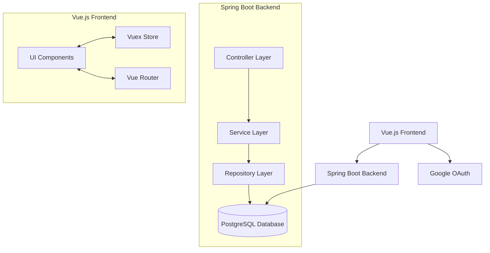
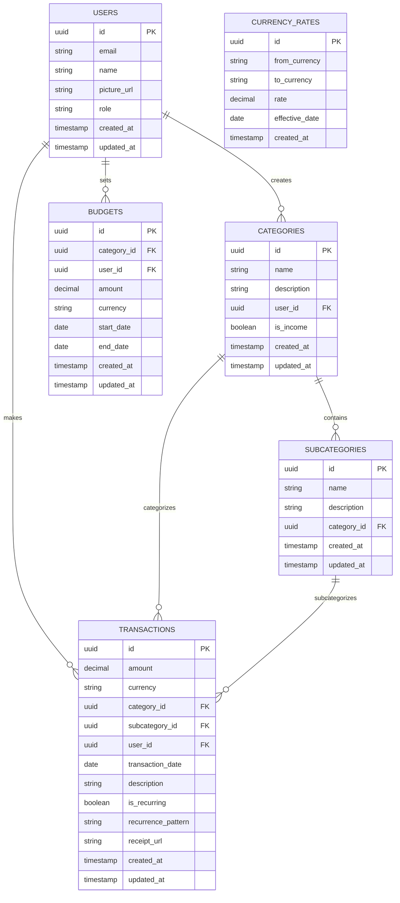
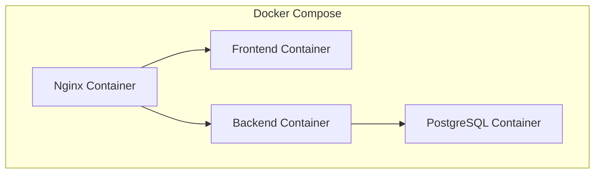

# Budget Tracker Application - Detailed Plan

## 1. System Architecture

The budget tracker will follow a monolithic architecture with a layered approach:



### Key Components:

1. **Frontend (Vue.js)**
   - Single Page Application
   - Responsive design using Vue.js with Vuetify or Element UI
   - Chart.js for trend visualization
   - Vuex for state management

2. **Backend (Java/Spring)**
   - Spring Boot for RESTful API development
   - Spring Security for authentication and authorization
   - Spring Data JPA for database operations
   - Layered architecture:
     - Controller Layer: Handles HTTP requests and responses
     - Service Layer: Contains business logic
     - Repository Layer: Handles data access and persistence

3. **Database (PostgreSQL)**
   - Relational database for storing user data, transactions, categories, and budgets

4. **Authentication**
   - OAuth 2.0 with Google login
   - JWT for session management
   - Role-based access control (admin, regular users)

5. **Docker**
   - Containerization of all components
   - Docker Compose for orchestration
   - Separate containers for frontend, backend, and database

## 2. Database Schema



## 3. Component Breakdown

### Frontend Components:

1. **Authentication Module**
   - Login page with Google OAuth
   - User profile management
   - Role-based UI elements

2. **Dashboard**
   - Summary of current month's expenses and income
   - Budget vs. actual spending visualization
   - Quick access to recent transactions
   - Currency selection (ZAR/INR)

3. **Transaction Management**
   - Transaction list with filtering and sorting
   - Add/edit/delete transactions
   - Receipt upload and viewing
   - Recurring transaction setup
   - Month selector

4. **Budget Management**
   - Set and modify budgets by category
   - Budget performance visualization
   - Monthly budget history

5. **Reports and Analytics**
   - Trend visualization with line graphs
   - Category-wise expense breakdown
   - Monthly comparison
   - Custom date range selection

6. **Data Import/Export**
   - CSV/Excel import functionality
   - Data export in multiple formats

### Backend Layers:

1. **Controller Layer**
   - AuthController: Handles authentication requests
   - TransactionController: Manages transaction CRUD operations
   - BudgetController: Handles budget management
   - ReportController: Provides reporting endpoints
   - UserController: Manages user operations

2. **Service Layer**
   - AuthService: Implements authentication logic
   - TransactionService: Implements transaction business logic
   - BudgetService: Implements budget management logic
   - ReportService: Implements reporting and analytics logic
   - UserService: Implements user management logic
   - CurrencyService: Handles currency conversion

3. **Repository Layer**
   - UserRepository: Data access for users
   - CategoryRepository: Data access for categories
   - SubcategoryRepository: Data access for subcategories
   - TransactionRepository: Data access for transactions
   - BudgetRepository: Data access for budgets
   - CurrencyRateRepository: Data access for currency rates

## 4. Implementation Approach

### Phase 1: Project Setup and Core Infrastructure

1. **Project Initialization**
   - Create project structure
   - Set up Git repository
   - Configure build tools (Maven/Gradle for backend, npm for frontend)

2. **Docker Environment Setup**
   - Create Dockerfiles for each component
   - Set up Docker Compose configuration
   - Configure PostgreSQL container

3. **Database Setup**
   - Create database schema
   - Set up migrations
   - Seed initial data (categories, currencies)

4. **Authentication Implementation**
   - Set up Spring Security
   - Implement Google OAuth integration
   - Create user management endpoints

### Phase 2: Core Functionality

1. **Transaction Management**
   - Implement CRUD operations for transactions
   - Create category and subcategory management
   - Implement basic filtering and sorting

2. **Budget Management**
   - Implement budget creation and modification
   - Create budget vs. actual calculations
   - Implement budget history

3. **Basic Reporting**
   - Implement data aggregation for reports
   - Create basic visualizations
   - Implement month selection functionality

### Phase 3: Advanced Features

1. **Currency Support**
   - Implement currency conversion
   - Create currency selection UI
   - Store and display amounts in selected currency

2. **Receipt Management**
   - Implement file upload functionality
   - Create receipt storage and retrieval
   - Link receipts to transactions

3. **Recurring Transactions**
   - Implement recurrence patterns
   - Create scheduled job for recurring transaction creation
   - Implement UI for managing recurring transactions

4. **Data Import/Export**
   - Create CSV/Excel import functionality
   - Implement data export in multiple formats
   - Add validation and error handling

### Phase 4: UI/UX and Finalization

1. **Mobile Responsiveness**
   - Optimize UI for mobile devices
   - Test on various screen sizes
   - Implement responsive design patterns

2. **Advanced Visualizations**
   - Enhance trend graphs
   - Add interactive elements to visualizations
   - Implement category-wise trend analysis

3. **Testing and Optimization**
   - Write unit and integration tests
   - Perform performance optimization
   - Conduct security testing

4. **Documentation and Deployment**
   - Create user documentation
   - Document API endpoints
   - Finalize Docker configuration for production

## 5. Docker Setup



### Docker Components:

1. **Frontend Container**
   - Node.js environment for Vue.js
   - Nginx for serving static files
   - Environment variables for API endpoints

2. **Backend Container**
   - Java runtime environment
   - Spring Boot application
   - Environment variables for database connection and configuration

3. **Database Container**
   - PostgreSQL database
   - Persistent volume for data storage
   - Initial schema creation and seeding

4. **Nginx Container**
   - Reverse proxy for routing requests
   - SSL termination
   - Static file serving

### Docker Compose Configuration:

- Network configuration for service communication
- Volume mapping for persistent data
- Environment variable management
- Health checks and restart policies

## 6. Development Timeline

### Week 1: Setup and Infrastructure
- Project initialization and repository setup
- Docker environment configuration
- Database schema design and implementation
- Authentication implementation

### Week 2-3: Core Backend Development
- Controller, service, and repository layer implementation
- Transaction management functionality
- Budget management functionality
- Basic reporting functionality

### Week 3-4: Frontend Foundation
- Vue.js project setup
- Authentication UI implementation
- Basic dashboard and navigation
- Transaction management UI

### Week 4-5: Advanced Features
- Currency conversion implementation
- Recurring transactions functionality
- Receipt storage and management
- Data import/export functionality
- Budget management UI
- Reporting and visualization components

### Week 5-6: Integration and Testing
- Integration of all components
- End-to-end testing
- Performance optimization
- Security testing and hardening
- Mobile responsive design implementation

### Week 7: Finalization and Deployment
- Documentation creation
- Final UI/UX improvements
- Docker production configuration
- Deployment preparation and testing

## 7. Technology Stack Details

### Frontend:
- Vue.js 3
- Vuex for state management
- Vue Router for navigation
- Axios for API communication
- Chart.js for visualizations
- Vuetify or Element UI for UI components
- Jest for testing

### Backend:
- Java 17
- Spring Boot 3.x
- Spring Security with OAuth 2.0
- Spring Data JPA
- Lombok for boilerplate reduction
- JUnit and Mockito for testing

### Database:
- PostgreSQL 15
- Flyway for migrations
- JSONB for flexible data storage where needed

### DevOps:
- Docker and Docker Compose
- Nginx for reverse proxy
- Maven/Gradle for Java build
- npm for frontend build
- Git for version control

## 8. Security Considerations

1. **Authentication and Authorization**
   - OAuth 2.0 with Google for secure authentication
   - JWT with appropriate expiration
   - Role-based access control
   - Secure cookie handling

2. **Data Protection**
   - Encryption of sensitive data
   - HTTPS for all communications
   - Secure storage of credentials and tokens

3. **API Security**
   - Input validation
   - Rate limiting
   - CSRF protection
   - Security headers

4. **Docker Security**
   - Minimal base images
   - Non-root users
   - Resource limitations
   - Regular security updates

## 9. Project Structure

### Backend Structure

```
budget-tracker-backend/
├── src/
│   ├── main/
│   │   ├── java/
│   │   │   └── com/
│   │   │       └── budgettracker/
│   │   │           ├── config/
│   │   │           ├── controller/
│   │   │           ├── dto/
│   │   │           ├── exception/
│   │   │           ├── model/
│   │   │           ├── repository/
│   │   │           ├── service/
│   │   │           ├── util/
│   │   │           └── BudgetTrackerApplication.java
│   │   └── resources/
│   │       ├── application.properties
│   │       ├── application-dev.properties
│   │       ├── application-prod.properties
│   │       └── db/
│   │           └── migration/
│   └── test/
│       └── java/
│           └── com/
│               └── budgettracker/
│                   ├── controller/
│                   ├── repository/
│                   └── service/
├── Dockerfile
├── pom.xml
└── README.md
```

### Frontend Structure

```
budget-tracker-frontend/
├── public/
│   ├── index.html
│   └── favicon.ico
├── src/
│   ├── assets/
│   ├── components/
│   │   ├── auth/
│   │   ├── budget/
│   │   ├── common/
│   │   ├── dashboard/
│   │   ├── reports/
│   │   └── transactions/
│   ├── router/
│   ├── store/
│   │   ├── modules/
│   │   │   ├── auth.js
│   │   │   ├── budget.js
│   │   │   ├── reports.js
│   │   │   └── transactions.js
│   │   └── index.js
│   ├── views/
│   ├── App.vue
│   └── main.js
├── Dockerfile
├── package.json
└── README.md
```

### Docker Structure

```
budget-tracker/
├── docker-compose.yml
├── .env
├── nginx/
│   ├── nginx.conf
│   └── Dockerfile
├── budget-tracker-backend/
└── budget-tracker-frontend/
```

## 10. Next Steps

1. Create the project structure
2. Set up the development environment with Docker
3. Implement the core functionality
4. Develop the frontend components
5. Integrate and test the application
6. Deploy the application